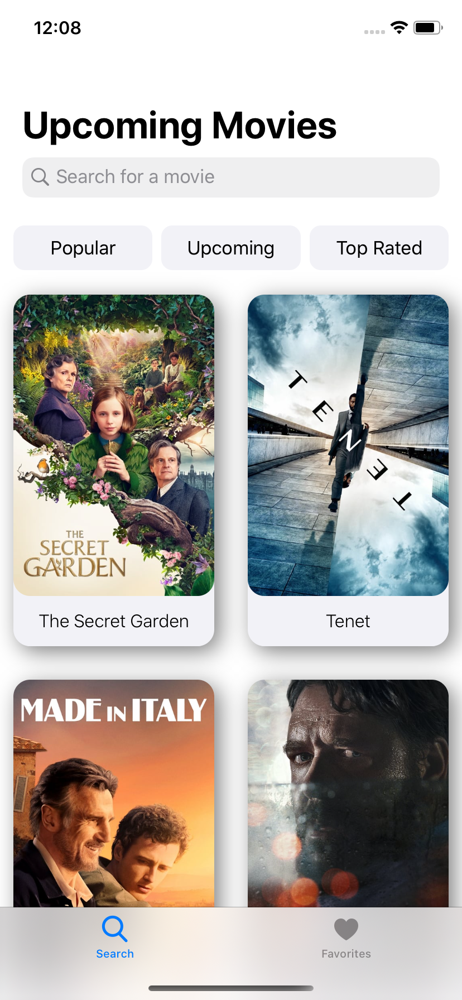

<h1 id="movies">Movies</h1>

Movies App gets 20 movies from TheMovieDB API according to chosen category. Dark mode is also supported. Main features: - Gets top, popular or upcoming movies and displays them in collection view cells - Any movie can be searched in these cells - Details of movie are displayed on details page - Any movie can be added to favorites or can be deleted from favorites

<h1 id="technologies-used">Technologies Used</h1>
<ul>
<li>UIKit</li>
<li>MVC Design Pattern</li>
<li>No Storyboard, only programmatic UI</li>
<li>Networking</li>
<li>JSON Parsing</li>
<li>Public APIs</li>
<li>UICollectionViewDiffableDataSource</li>
<li>UserDefaults</li>
<li>UICollectionView</li>
<li>Custom CollectionViewCell, UICollectionReusableView</li>
<li>UITableView</li>
<li>Custom TableViewCell</li>
<li>Custom UIAlert</li>
<li>Custom UILabel</li>
<li>Custom UIButton</li>
</ul>
<h1 id="getting-started">Getting Started</h1>

Get the Api key from <a href="https://developers.themoviedb.org/3/getting-started/introduction">TheMovieDB API</a> and use it in NetworkConstants.

<h1 id="compatibility">Compatibility</h1>

This project is written in Swift 5.0 and Xcode 11 is used.

<h1 id="images">Images</h1>

    

    

    
    

    
    

        

      

    

    

    

    

